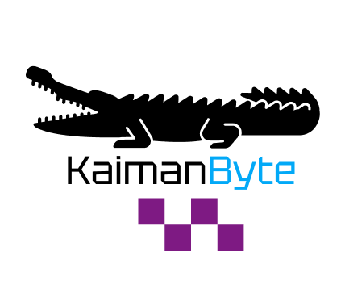

# ABP - Website do Laboratório de Sensoriamento Remoto Agrícola (AgriRS Lab)

  

  <a href="#descrição-do-projeto">Sobre o Projeto</a> |
  <a href="#entregas-de-sprints">Entrega de Sprints</a> |
  <a href="#recursos-do-produto">Recursos do Produto</a> |
  <a href="#protótipo-no-figma">Protótipo</a> |
  <a href="#equipe">Nossa Equipe</a>

## Descrição do Projeto
O projeto ABP (Aprendizagem Baseada em Projeto) desenvolvido como atividade do 1° semestre do curso de **Desenvolvimento de Software Multiplataforma** da **Fatec Jacareí**, tem como objetivo criar um website para o **Laboratório de Sensoriamento Remoto Agrícola do INPE (AgriRS Lab)**.  

O site busca:

- Centralizar informações importantes sobre o laboratório.
- Ampliar a visibilidade das pesquisas e projetos do AgriRS Lab.
- Facilitar o acesso do público às iniciativas e atividades do laboratório.
- Divulgar informações sobre a equipe, áreas de atuação, publicações científicas, oportunidades de trabalho e formas de contato.

O projeto contribui para manter as atividades e descobertas científicas atualizadas para a comunidade e promove a divulgação do laboratório para interessados em conhecer ou colaborar com o trabalho desenvolvido.

## Entregas de Sprints

Todas as entregas serão realizadas conforme os prazos acordados com o cliente. Para cada ciclo de desenvolvimento, será gerado um relatório completo por sprint e uma planilha de tarefas, na aba **Tasks**, que detalha cada atividade executada, o responsável, a data de conclusão e uma descrição do trabalho realizado. A relação detalhada das sprints e tarefas é apresentada abaixo.

| Sprint | Entrega       | Status |                 Relatório                  |
|------: |---------------|:------:|:------------------------------------------:|
| 1      | 📅 08/10/2025 | ✅     | [Ver Backlog](./documentação/sprints/sprint_1.md)|
| 2      | 📅 04/11/2025 | ✅  | [Ver Backlog](./documentação/sprints/sprint_2.md)|
| 3      | 📅 25/11/2025 | ✅      | [Ver Backlog](./documentação/sprints/sprint_3.md)|

**Legenda:**
- ✅ **Finalizada**
- 🚧 **Em Progresso**
- `—` **Não iniciado**

## Recursos do Produto 

- **Backlog do Produto:** [Acesse aqui](./documentação/requisitos.md)  
  Lista detalhada de requisitos funcionais e não funcionais, utilizados como referência para o desenvolvimento do projeto.

- **Modelagem do Banco de Dados:** [Acesse aqui](./documentação/imagens/ModelagemBancoDados.jpeg)  
  Descrição e diagrama das entidades, relacionamentos e estrutura do banco de dados utilizado no sistema, servindo como base para o desenvolvimento e integração com o backend.

- **Definition of Ready (DoR):** [Acesse aqui](./documentação/Definition-of-Ready-Kaiman-Byte.md)  
  Critérios que definem quando uma *user story* está devidamente preparada para entrar em uma sprint, garantindo clareza, estimativa e entendimento pelo time.

- **Definition of Done (DoD):** [Acesse aqui](./documentação/Definition-of-Done-Kaiman-Byte.md)  
  Conjunto de critérios que determinam quando uma tarefa ou *user story* é considerada concluída, assegurando qualidade, revisão e alinhamento com os padrões do projeto.

- **Diagrama de Caso de Uso (UML):** [Acesse aqui](./documentação/UML/UML%20-%20User%20Case.pdf)  
  Representação visual das interações entre os usuários (atores) e o sistema, ilustrando os principais casos de uso e funcionalidades do projeto.

## Protótipo no Figma

O protótipo do website pode ser acessado clicando no link abaixo:  

👉 [Acessar o protótipo no Figma](https://www.figma.com/design/K23V3Avem7YWoJbB8BKE7U/ABP---AgriRSLab?node-id=0-1&m=dev&t=rt6k9meCGb6z5Qwn-1)

## Equipe

| Nome | Função | GitHub | LinkedIn |
|------|--------|--------|----------|
| Luka Gomes | Scrum Master | [Github](https://github.com/LukaGomes) | [LinkedIn](https://www.linkedin.com/in/luka-gomes-de-souza-chaves-12b68718a/) |
| Erick Rost | Product Owner | [Github](https://github.com/erickrost) | [LinkedIn](https://www.linkedin.com/in/erick-rost/) |
| Vitória Vargas | Desenvolvedor | [Github](https://github.com/vitvargas) | [LinkedIn](http://www.linkedin.com/in/vit%C3%B3ria-barbara-vargas-9b920b351) |
| Rafael Melo | Desenvolvedor | [Github](https://github.com/RafaelPMR) | [LinkedIn](https://www.linkedin.com/in/rafael-prado-de-melo-raimundo-55a150144?utm_source=share&utm_campaign=share_via&utm_content=profile&utm_medium=ios_app) |
| João Pedro | Desenvolvedor | [Github](https://github.com/JoaoPedroLuvisariSeveriano) | [LinkedIn](https://www.linkedin.com/in/jo%C3%A3o-pedro-luvisari-severiano-bb1aa9303/) |
| Breno Augusto | Desenvolvedor | [Github](https://github.com/brenoasj) | [LinkedIn](https://www.linkedin.com/in/brenoaugusto1910?utm_source=share&utm_campaign=share_via&utm_content=profile&utm_medium=android_app) |
| Gabriel Oliveira | Desenvolvddor  | [Github](https://github.com/GabrielOlsa) | [LinkedIn](https://www.linkedin.com/in/gabriel-oliveira-96013138b?utm_source=share_via&utm_content=profile&utm_medium=member_android) |
| Thiago Guedes | Desenvolvedor | [Github](https://github.com/Thiago-Tolosa) | [LinkedIn](https://www.linkedin.com/in/thiago-guedes-4965b0390?utm_source=share_via&utm_content=profile&utm_medium=member_android) |
