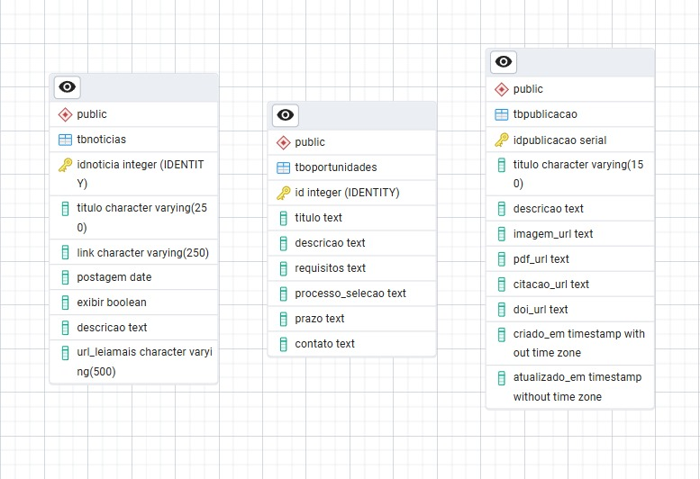

# Sprint 2

## 🎯 Objetivo da Sprint 2

Realizar a **adaptação do design** do site com base no feedback do cliente, entregar o produto **totalmente responsivo e adaptável** a diferentes tamanhos de tela, e desenvolver a **modelagem do banco de dados** com sua **integração ao site via servidor local**, permitindo que as páginas de **Publicações, Notícias e Vagas** sejam alimentadas diretamente pelo banco de dados.

---

## 🧩 Sprint Backlog - Sprint 2

| ID | Seção / Atividade | Pontuação | Disciplina | Sprint | Requisito |
|----|--------------------|------------|-------------|----------|------------|
| **ES-014** | UML - Diagrama de Sequência | 8 | ES | 2 | - |
| **ES-015** | UML - Diagrama de Classes | 8 | ES | 2 | - |
| **DD-012** | Criar layout no Figma (Administrativo) | 13 | DD | 2 | RNF02 |
| **DW-028** | Criar arquivo HTML (Administrativo) | 13 | DW | 2 | RNF02 |
| **DW-029** | Aplicar design CSS (Administrativo) | 13 | DW | 2 | RNF02 |
| **MB-001** | Modelagem do banco de dados (Publicações) | 8 | MB | 2 | RNF02 |
| **MB-002** | Modelagem do banco de dados (Notícias) | 8 | MB | 2 | RNF02 |
| **MB-003** | Modelagem do banco de dados (Vagas) | 8 | MB | 2 | RNF02 |
| **DW-030** | Responsividade Mobile (Home) | 8 | DW | 2 | RNF01 |
| **DW-031** | Responsividade Mobile (Sobre) | 8 | DW | 2 | RNF01 |
| **DW-032** | Responsividade Mobile (Vagas) | 8 | DW | 2 | RNF01 |
| **DW-033** | Responsividade Mobile (Membros) | 8 | DW | 2 | RNF01 |
| **DW-034** | Responsividade Mobile (Projetos) | 8 | DW | 2 | RNF01 |
| **DW-035** | Responsividade Mobile (Notícias) | 8 | DW | 2 | RNF01 |
| **DW-036** | Responsividade Mobile (Publicações) | 8 | DW | 2 | RNF01 |
| **DW-037** | Responsividade Mobile (Contato) | 8 | DW | 2 | RNF01 |
| **SO-001** | Testar responsividade em dispositivos distintos | 13 | SO | 2 | RNF01 |
| **ES-001** | Implementar CRUD de vagas (back-end) | 13 | ES | 2 | RNF02 |
| **ES-002** | Implementar CRUD de notícias (back-end) | 13 | ES | 2 | RNF02 |
| **ES-003** | Implementar CRUD de publicações (back-end) | 13 | ES | 2 | RNF02 |
| **ES-006** | Criar envio de e-mail via formulário (Contato) | 5 | ES | 2 | - |
| **ES-007** | Documentar passo a passo de atualização de conteúdo pelos membros | 8 | ES | 2 | - |
| **MB-006** | Alimentar bancos de dados com os dados fornecidos | 13 | MB | 2 | - |
| **MB-007** | Conectar bancos de dados com CRUD | 13 | MB | 2 | - |

---

## Backlog de Gestão do Projeto

| ID      | Atividade | Pontuação | Disciplina | Sprint |
|---------|-----------|-----------|------------|--------|
| **ES-014** | **Scrum Master:** Facilitar cerimônias ágeis (Daily, Planning, Review, Retrospective), acompanhar impedimentos, garantir comunicação eficaz e apoiar a equipe na aplicação do DoD. | 20 | ES | 1 |
| **ES-015** | **Product Owner:** Refinar e priorizar backlog, alinhar requisitos com stakeholders, validar entregas nas reviews e garantir clareza nos critérios de aceitação. | 20 | ES | 1|

---

## 📅 Distribuição de Atividades - Sprint 2

| Integrantes | 13/out | 17/out | 21/out | 23/out | 31/out |
|--------------|--------|--------|--------|--------|--------|
| **Breno Augusto Santos Jesus** | DW-035 | DW-035 | MB-006 | MB-006 | ES-003 |
| **Erick Rost Santos (PO)** | DW-034 / ES-015 | DW-034 / ES-015 | SO-001 / ES-015 | SO-001 / ES-015 | ES-015 |
| **Gabriel Oliveira dos Santos** | DW-033 | DW-033 | DD-012 | DD-012 | ES-002 |
| **João Pedro Luvisari Severiano** | DW-036 | DW-036 | MB-001 | MB-001 | MB-007 |
| **Luka Gomes Souza Chaves (SM)** | DW-030 / ES-014 | DW-030 / ES-014 | ES-016 / ES-014 | ES-016 / ES-014 | ES-014 |
| **Rafael Prado de Melo Raimundo** | DW-037 | DW-037 | DW-028 | DW-029 | ES-006 |
| **Thiago Guedes da Silva Tolosa** | DW-031 | DW-031 | MB-002 | MB-002 | ES-001 |
| **Vitoria Barbara Vargas** | DW-032 | DW-032 | MB-003 | MB-003 | ES-007 |

---

## Sprint Burndown

---

## 🔄 Retrospectiva da Sprint 2
Nesta sprint, o time mostrou maior adaptação ao Scrum e trabalhou com mais ritmo e organização. Conseguimos entregar um site totalmente responsivo para tablets e dispositivos móveis, além de ajustar as cores conforme o feedback do cliente, tornando o visual mais vivo e atrativo.

Implementamos as páginas de Publicações, Notícias e Vagas com integração ao banco de dados via Node.js, e desenvolvemos a tela de login e o CRUD de gerenciamento funcional.

A equipe evoluiu tecnicamente e se mostrou mais entrosada, garantindo entregas de qualidade e consolidando a base para as próximas sprints.

---

## Modelagem do Banco de Ddaos

