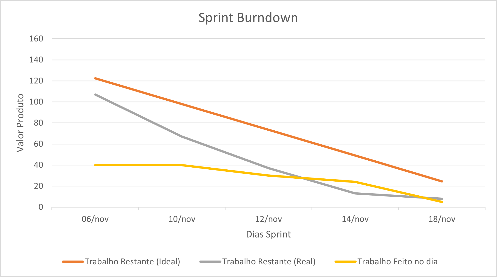

# Sprint 3

## 🎯 Objetivo da Sprint 3

A Sprint 3 teve como objetivo finalizar as traduções do site, padronizar os CRUDs, e implementar funcionalidades essenciais do ambiente administrativo, como login, criptografia, tokenização e upload de imagens. Também incluímos ajustes de SQL e definição das etapas para execução do projeto.

---

## 🧩 Sprint Backlog - Sprint 3

| ID       | Seção / Atividade                         | Pontuação | Disciplina | Sprint | Requisito |
|----------|--------------------------------------------|-----------|------------|--------|-----------|
| **DW-038** | Tradução página Início                   | 8         | DW         | 3      | RNF04     |
| **DW-039** | Tradução página Sobre                    | 8         | DW         | 3      | RNF04     |
| **DW-040** | Tradução página Vagas                    | 8         | DW         | 3      | RNF04     |
| **DW-041** | Tradução página Membros                  | 8         | DW         | 3      | RNF04     |
| **DW-042** | Tradução página Projetos                 | 8         | DW         | 3      | RNF04     |
| **DW-043** | Tradução página Notícias                 | 8         | DW         | 3      | RNF04     |
| **DW-044** | Tradução página Publicações              | 8         | DW         | 3      | RNF04     |
| **DW-045** | Tradução página Contato                  | 8         | DW         | 3      | RNF04     |
| **DW-046** | Tokenização para acesso ao ADM          | 8         | DW         | 3      | -         |
| **DW-047** | Seletor de Idioma                        | 8         | DW         | 3      | RNF04     |
| **DW-048** | Padronização CRUD Publicações            | 5         | DW         | 3      | -         |
| **DW-049** | Padronização CRUD Vagas                  | 5         | DW         | 3      | -         |
| **DW-050** | Padronização CRUD Notícias               | 5         | DW         | 3      | -         |
| **DW-051** | Padronização de scripts SQL              | 5         | DW         | 3      | -         |
| **AL-001** | Sistema de login                         | 13        | AL         | 3      | -         |
| **AL-002** | Criptografia de senha                    | 13        | AL         | 3      | -         |
| **AL-003** | Configuração para Upload de imagens      | 13        | AL         | 3      | -         |
| **ES-018** | Definição de etapas para rodar o projeto | 8         | ES         | 3      | -         |

---

## Backlog de Gestão do Projeto

| ID      | Atividade | Pontuação | Disciplina | Sprint |
|---------|-----------|-----------|------------|--------|
| **ES-014** | **Scrum Master:** Facilitar cerimônias ágeis (Daily, Planning, Review, Retrospective), acompanhar impedimentos, garantir comunicação eficaz e apoiar a equipe na aplicação do DoD. | 20 | ES | 1 |
| **ES-015** | **Product Owner:** Refinar e priorizar backlog, alinhar requisitos com stakeholders, validar entregas nas reviews e garantir clareza nos critérios de aceitação. | 20 | ES | 1|

---

## 📅 Distribuição de Atividades - Sprint 3

| Integrantes | 06/nov | 10/nov | 12/nov | 14/nov | 18/nov | 24/nov |
|-------------|--------|--------|--------|--------|--------|--------|
| **Breno Augusto Santos Jesus** | DW-038 | DW-038 | DW-048 | DW-048 | DW-046 | DW-046 |
| **Erick Rost Santos (PO)** | DW-039/ES-015 | DW-039/ES-015 | ES-015 | ES-015 | ES-015 | ES-015 |
| **Gabriel Oliveira dos Santos** | DW-040 | DW-040 | DW-049 | DW-049 | DW-049 | DW-049 |
| **João Pedro Luvisari Severiano** | DW-041 | DW-041 | AL-001 | AL-001 | AL-002 | AL-002 |
| **Luka Gomes Souza Chaves (SM)** | DW-042/ES-014 | DW-042/ES-014 | ES-014 | ES-014 | ES-014 | ES-014 |
| **Rafael Prado de Melo Raimundo** | DW-043 | DW-043 | DW-050 | DW-050 | DW-050 | DW-050 |
| **Thiago Guedes da Silva Tolosa** | DW-044 | DW-044 | DW-051 | DW-051 | AL-003 | AL-003 |
| **Vitoria Barbara Vargas** | DW-045 | DW-045 | DW-047 | DW-047 | ES-018 | ES-018 |

---

## Sprint Burndown

---

## 🔄 Retrospectiva da Sprint 3
Nesta sprint, o time demonstrou ainda mais maturidade no processo, trabalhando com foco, consistência e um ritmo muito mais fluido. A equipe mostrou domínio maior das tarefas e autonomia para resolver problemas técnicos, o que deixou o desenvolvimento mais rápido e organizado.

Conseguimos padronizar e integrar todas as páginas institucionais, concluindo as traduções e garantindo uma experiência de navegação alinhada ao padrão do projeto. Também avançamos firme no backend: CRUDs padronizados, scripts SQL revisados e funcionalidades essenciais do ADM, como login, criptografia de senha, tokenização e upload de imagens, foram implementados com sucesso.

Além disso, a equipe reforçou a base estrutural do sistema, deixando o ambiente administrativo mais sólido e pronto para evoluições futuras. O entrosamento do grupo ficou ainda mais evidente, e o resultado foi uma sprint com entregas de alta qualidade e um produto cada vez mais profissional.

---
